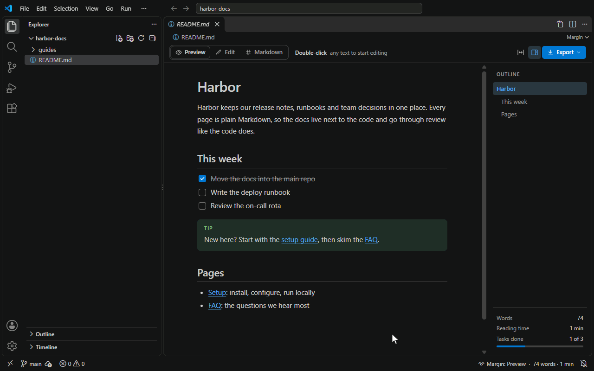

# Edit Markdown as a page. Commit plain text.

Margin turns the Markdown in your repo into a Notion-style knowledge base. Your `.md` files open as clean pages you edit in place, with linked pages, slash commands and AI. Underneath, they stay plain Markdown files in git, and only the lines you change change.



## What you get

**Write like Notion**

- Edit right on the page; Cmd+E / Ctrl+E switches between Preview and Edit
- Slash menu, selection menu, drag-and-drop blocks
- Callouts, tables, checkboxes, Mermaid diagrams
- AI on any selection: improve, shorten, translate, continue writing

**A knowledge base in your repo**

- Links between docs open like pages, and Back takes you back
- Broken links are flagged, and a missing page is one click away
- An outline, word count and task progress for every page

**Plain Markdown underneath**

- Only the lines you edit change, so git diffs stay clean
- Export to PDF or HTML, or copy as rich text for Slack and email
- Follows your theme; works in VS Code, Cursor, Windsurf and VSCodium

## Get started

1. Install Margin from the VS Code Marketplace, or from Open VSX for Cursor, Windsurf and VSCodium.
2. Open any `.md` file and click **Open in Margin** at the top right of the editor. To open every Markdown file in Margin, accept when Margin offers it, or right-click a file → Open With… → Configure default editor.
3. Press Cmd+E / Ctrl+E to start editing, or double-click any text.

Undo is VS Code's own history, so Cmd+Z / Ctrl+Z works across Margin, the text editor and git. **Reopen in Text Editor** gives you the raw file at any time.

## Keyboard shortcuts

| Action | Windows / Linux | macOS |
| --- | --- | --- |
| Preview / Edit | Ctrl+E | Cmd+E |
| Bold / Italic | Ctrl+B / Ctrl+I | Cmd+B / Cmd+I |
| Strikethrough | Ctrl+Shift+X | Cmd+Shift+X |
| Highlight | Ctrl+Shift+H | Cmd+Shift+H |
| Inline code | Ctrl+\` | Cmd+\` |
| Link | Ctrl+K | Cmd+K |
| Undo / Redo | Ctrl+Z / Ctrl+Y | Cmd+Z / Cmd+Shift+Z |
| Line break inside a block | Shift+Enter | Shift+Enter |
| Indent / outdent a list item | Tab / Shift+Tab | Tab / Shift+Tab |
| Back / Forward | Alt+← / Alt+→ (Linux: Ctrl+Alt+- / Ctrl+Shift+-) | Ctrl+- / Ctrl+Shift+- |
| Open a link in a new tab | Ctrl+click | Cmd+click |

While you edit, these keys belong to Margin: Ctrl+B makes text bold instead of toggling the sidebar, and Ctrl+K edits a link instead of starting a chord. In Preview and everywhere else they work as usual.

## Settings

| Setting | Default | What it does |
| --- | --- | --- |
| `margin.defaultMode` | `preview` | Mode a file opens in: `preview` or `edit`. |
| `margin.pageWidth` | `normal` | Text column: `narrow`, `normal`, `wide` or `full`. Each file can keep its own width (toolbar or **Margin: Change Page Width**). |
| `margin.links.openIn` | `sameTab` | `sameTab`: linked pages reuse one tab as you click through. `newTab`: each page gets its own tab. Ctrl/Cmd+click does the opposite. |
| `margin.ai` | `auto` | Where AI actions go: `auto`, `editor`, `chatgpt`, `claude` or `off`. See Privacy. |
| `margin.outline.visible` | `true` | Show the outline panel when there is room. |
| `margin.toolbar.backForward` | `false` | Show Back and Forward buttons in the toolbar. |
| `margin.exportFolder` | *(empty)* | Folder for exports, relative to the workspace. Empty: next to the Markdown file. |
| `margin.export.theme` | `light` | Colours of exported files: `light`, `dark` or `auto`. |
| `margin.export.browserPath` | *(empty)* | Chrome, Edge or Chromium for PDF export. Empty: found automatically. |

## Privacy

Margin makes no network requests of its own. Remote images in your documents load like in VS Code's Markdown preview. Margin collects no telemetry.

Text leaves your machine only when you run an AI action, and only what that action needs. The first time, Margin tells you where it is going and asks first:

- With GitHub Copilot in VS Code, the text goes to Copilot through VS Code, under your Copilot account.
- Otherwise a chat opens with the prompt: Copilot Chat in VS Code, a new chat in Cursor, or chatgpt.com or claude.ai in your browser. Nothing is sent until you press Enter there.
- `margin.ai: off` hides AI actions completely.

## Guide

### Your file stays yours

Blocks you didn't touch are written back byte-for-byte: spacing, list markers, emphasis style and line endings. An edited block is written in the style the file already uses. Frontmatter, raw HTML, footnote definitions and math are shown read-only and kept exactly as written; edit them in Markdown mode. The test suite opens and saves 33 real-world files, popular READMEs among them, and every one must come back unchanged.

### Writing

- Type `/` on an empty line for headings, lists, to-dos, quotes, callouts, code, tables, dividers and diagrams. Each item shows its Markdown.
- Markdown shortcuts work as you type: `#`, `-`, `1.`, `>`, `[]`, `` ``` `` and `---`.
- Hover a block and drag its handle to move it, or click the handle to duplicate or delete it.
- In tables, Tab moves to the next cell, and Tab in the last cell adds a row. The block handle adds a row below or a column on the right, and deletes rows or columns.
- GitHub callouts (`> [!NOTE]`, `[!TIP]`, `[!WARNING]`…) and checkboxes you can tick even in Preview.

### Links and pages

- A link to `./setup.md`, `../guides/` or `/docs/faq.md#install` opens that page in Margin, scrolled to the heading. A folder opens its `README.md` or `index.md`.
- A click opens a link, in Edit mode too. To edit a link's text, click just after it; hovering shows Open, Edit link and Copy link.
- Linked pages reuse one tab while you click through, unless you change `margin.links.openIn`; editing a page keeps its tab.
- A link to a missing file gets a red underline. Click it to create the page.
- Back (Alt+←, Ctrl+- on macOS, or the mouse's back button) returns from a `#section` jump first, then to the previous page.

### AI

Improve writing, Shorten, Make longer, Fix spelling and grammar, Translate, Summarize, Continue writing, or Ask AI with your own instruction: from AI in the toolbar, ✨ in the selection menu, or `/ai`. With Copilot the answer appears under your text; Accept replaces it in one undo step. Elsewhere, paste the chat's answer back and it turns into formatted blocks.

### Export

PDF uses the Edge or Chrome already on your machine, so there's nothing to download. HTML is a single file. Copy as rich text for Slack, email or Confluence, or copy as Markdown.

## License

Free and MIT licensed. Built on ProseMirror and the unified/micromark Markdown tools; their licenses are in `THIRD-PARTY-NOTICES.txt`.
